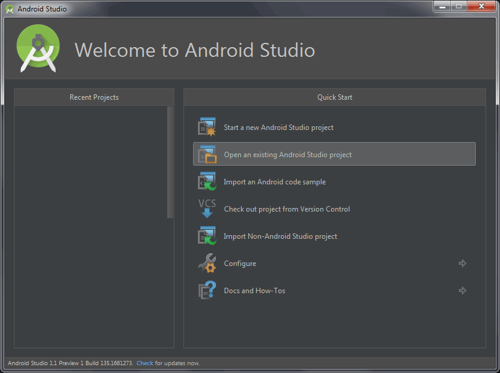
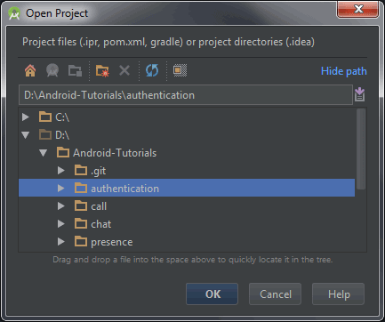
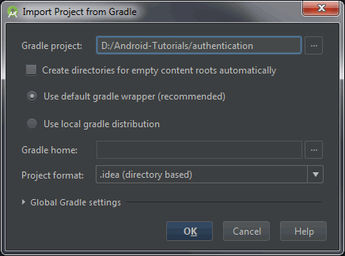

# Tutorials 

- [Authentication](authentication)
- [Presence](presence)
- [Chat](chat)
- [Call](call)

### Download

```shell
# To download the source code
git clone https://github.com/sightcall/Android-Tutorials

# To update the source code
git pull
```

### Open a tutorial

##### Step 1

Open Android Studio and select `Open an existing Android Studio project`



##### Step 2

Select one of the tutorials



##### Step 3

Verify the gradle project location.  
`Use default gradle wrapped` must be checked.




### Configuration

Every tutorial has a configuration file located here:  
`app/src/main/java/net/rtccloud/tutorial/Config.java`

You **must** set these three values in order to run the tutorial:

```java
/**
 * Application identifier, available on the portal website.
 */
public static final String APP_ID = "";

/**
 * URL of the token server.
 * It must contain the pattern `%s`.
 * This pattern will automatically be replaced with the provided uid.
 * Example: `https://token-server.com?uid=%s`
 */
public static final String AUTH_URL = "";

/**
 * Credentials to use if the token server is secured with an htaccess dotfile.
 * Leave it empty if the token server is publicly available.
 * It should be this format: `login:pwd`
 */
public static final String AUTH_PWD = "";
```

